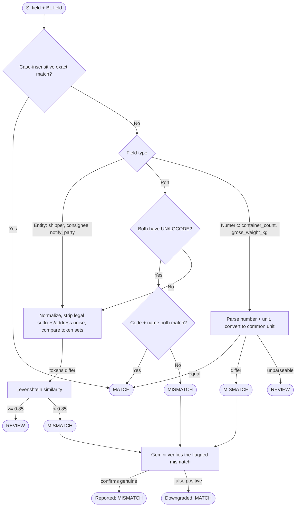

# dareDEVils-AverisXMonash-Hackathon
Team dareDEVils Repo for Averis X Monash Hackathon

# Operum

**Confidence-Aware Discrepancy Detection for Shipping Instructions and Bills of Lading**

*Classify inbound shipping emails, compare SI against draft BL, and escalate only what actually needs a human.*

[Repo](https://github.com/SGTK06/dareDEVils-AverisXMonash-Hackathon) · [Live Client](https://daredevils-averisxmonash-hackathon.onrender.com/) · [How It Works](#how-it-works) · [Quick Start](#quick-start)

`python` `fastapi` `react` `random-forest` `sentence-transformers` `levenshtein` `gemini` `human-in-the-loop` `supabase` `document-comparison` `email-classification`

---

## Table of Contents

- [The Problem](#the-problem)
- [The Solution](#the-solution)
- [Use Cases](#use-cases)
- [Features](#features)
- [Architecture](#architecture)
- [How It Works](#how-it-works)
  * [Classification: Text to Category](#classification-text-to-category)
  * [Extraction: Document to Fields](#extraction-document-to-fields)
  * [Comparison: Finding Hidden Discrepancies](#comparison-finding-hidden-discrepancies)
- [Model Selection](#model-selection)
- [Quick Start](#quick-start)
- [Project Structure](#project-structure)
- [Comparison Fields Reference](#comparison-fields-reference)
- [Reliability Model](#reliability-model)
- [Tech Stack](#tech-stack)

---

## The Problem

Shipping operations teams triage a shared inbox where every email could be a Shipping Instruction (SI), a request to compare an SI against a draft Bill of Lading (BL), an invoice query, or something unrelated. Two failure modes show up here:

**Inbox triage is manual and slow.** Every email has to be opened, read, and routed by a person before any actual comparison work starts. Nothing about the intent of the email is known until a human reads it.

**Document comparison hides real risk in two directions.** A shipper name spelled `SINGAPORE` in one document and `Singapore` in the other is not a discrepancy — but a genuinely different consignee is. A gross weight of `22,000KG` and `22MT` are the same value in different units, while two different container counts are not. Naive exact-string matching flags harmless formatting differences as mismatches and misses cases that actually matter — either way, operators lose trust in the tool.

## The Solution

Operum layers cheap, deterministic checks first and only escalates to an LLM when a check flags something worth double-checking.

```
mail arrives
    ↓
classify intent (embeddings + Random Forest)
    ↓
(if BL comparison) parse both documents
    ↓
extract known fields by label
    ↓
apply any human-in-the-loop overrides
    ↓
compare each field with the applicable deterministic method
    ↓
verify flagged mismatches with Gemini
    ↓
status: OK / MISMATCH / NEEDS_REVIEW
```

Every field comparison resolves to a verdict backed by an explicit reason (evidence). A mismatch is never auto-reported without a Gemini sanity-check first, and a missing, unreadable, or ambiguous value never becomes a guessed match or mismatch — it becomes `NEEDS_REVIEW`.

**Escalate uncertainty instead of guessing. Keep source evidence beside every decision. Make every human correction explicit, editable, and auditable.**

---

## Use Cases

| Use Case | What Operum Provides |
| --- | --- |
| **Inbox triage** | Every inbound email is classified into BL comparison, SI request, invoice query, general, or spam — before a human opens it. |
| **SI vs draft BL comparison** | Shipper, consignee, notify party, port of loading, port of discharge, container count, and gross weight are automatically cross-checked between the two documents. |
| **Named entity comparison** | Company names (shipper/consignee/notify party) are normalized, stripped of legal-entity suffixes and address noise, and compared by token set and Levenshtein similarity rather than exact string match. |
| **Port comparison** | Ports are compared by UN/LOCODE when present, falling back to normalized port name matching when no code is available. |
| **Unit-safe numeric comparison** | Gross weight values in different units (KG, G, LB, TON) are converted to a common unit before comparison so equivalent values are never flagged as mismatches. |
| **LLM-verified mismatches** | Every field flagged as a mismatch is re-checked by Gemini before being reported, catching false positives the deterministic rules miss. |
| **Human-in-the-loop correction** | Operators can override extracted field values per email; overrides are applied before comparison re-runs, and corrections are persisted. |

---

## Features

| Feature | Description |
| --- | --- |
| **Two-stage intent classification** | Sentence embeddings (`all-MiniLM-L6-v2`) + a pre-trained Random Forest classifier determine mail intent; confidence below threshold is flagged `NEEDS_REVIEW`. |
| **Filetype-aware document parsing** | `.txt`/`.csv` read directly, `.xlsx` via pandas, `.docx` via python-docx, `.pdf` via pypdf text extraction. |
| **Alias-based field extraction** | A fixed alias table maps differently-worded document labels (e.g. "Load Port", "POL", "Port of Loading") to the same canonical field. |
| **Cascading field comparison** | Case-insensitive exact match first; only genuinely different values proceed to entity/port/numeric-specific comparison logic. |
| **Unit and code normalization** | Numeric fields are unit-converted before comparison; ports are matched on UN/LOCODE when available. |
| **Gemini-verified mismatches** | Every MISMATCH verdict is re-checked by Gemini, which can downgrade a false-positive mismatch back to a match with an explanation. |
| **Auditable human correction loop** | Field-level operator overrides are applied before re-comparison and persisted to Supabase. |

---

## Architecture

```
┌───────────────────────────────────────────────────────────────────┐
│                         SHARED INBOX (EMAIL)                       │
└───────────────────────────────────┬─────────────────────────────────┘
                                    │
                                    ▼
┌───────────────────────────────────────────────────────────────────┐
│                     INTENT CLASSIFICATION                          │
│   Text → all-MiniLM-L6-v2 embedding → Random Forest → category     │
│   confidence < threshold ──▶ NEEDS_REVIEW                          │
└───────────────────────────────────┬─────────────────────────────────┘
                                    │ (category = BL Comparison Request)
                                    ▼
┌───────────────────────────────────────────────────────────────────┐
│              DOCUMENT PARSING (SI & BL attachments)                │
│   .txt/.csv → plain text · .xlsx → pandas                          │
│   .docx → python-docx · .pdf → pypdf text extraction                │
└───────────────────────────────────┬─────────────────────────────────┘
                                    │
                                    ▼
┌───────────────────────────────────────────────────────────────────┐
│         ALIAS-BASED FIELD EXTRACTION (7 canonical fields)          │
└───────────────────────────────────┬─────────────────────────────────┘
                                    │
                                    ▼
┌───────────────────────────────────────────────────────────────────┐
│           HUMAN-IN-THE-LOOP OVERRIDES APPLIED (if any)             │
└───────────────────────────────────┬─────────────────────────────────┘
                                    │
                                    ▼
┌───────────────────────────────────────────────────────────────────┐
│                     PER-FIELD COMPARISON PIPELINE                  │
│   Exact match → entity normalization + Levenshtein →                │
│   UN/LOCODE / port name → unit-aware numeric comparison             │
└───────────────────────────────────┬─────────────────────────────────┘
                                    │ mismatch found
                                    ▼
┌───────────────────────────────────────────────────────────────────┐
│              GEMINI DISCREPANCY VERIFICATION (per mismatch)         │
└───────────────────────────────────┬─────────────────────────────────┘
                                    │
                                    ▼
┌───────────────────────────────────────────────────────────────────┐
│         STATUS: OK / MISMATCH / NEEDS_REVIEW (React client)        │
│     comparison/classification persisted to Supabase; field          │
│     overrides stored locally in data_v2/overrides.json              │
└───────────────────────────────────────────────────────────────────┘
```

**Client/server split:** the React client (`/client`) is the operator-facing review workspace; the FastAPI server (`/server`) exposes classification and comparison as API endpoints (`server/app.py`) and coordinates the pipeline (`comparison_service.py`, `classification/`, `comparison/`).

**Note:** `server/ingest/llama_parse.py` (LlamaParse-based document parsing) and `server/llm/gemini.py`'s `extract_with_gemini` (LLM-based field extraction) exist as separate, available modules but are not currently wired into the live `compare_email` flow — extraction there is done via local document parsing + alias matching, and Gemini is only called to verify already-flagged mismatches.

`server/comparison/legacy_compare.py` and `legacy_item_compare.py` are an older, standalone comparison implementation (includes cosine-similarity-based item/feature/unit comparison for a `description_of_goods` field). Only one function from `legacy_compare.py` — `find_attachment_pair_for_email` (locates the SI/BL attachment files for an email) — is actually imported and used by the live `comparison_service.py`. The rest of that module, and all of `legacy_item_compare.py`, is unused by the live app and only runnable as a standalone CLI script.

---

## How It Works

### Classification: Text to Category

```
Author's mail text
    ↓
all-MiniLM-L6-v2 sentence embedding (normalized)
    ↓
Random Forest Classifier
    ↓
Category + confidence score
    ↓
confidence < review_threshold (default 0.80) ──▶ flagged NEEDS_REVIEW
    ↓
✓ Category is resolved
```

Categories: **BL_COMPARISON, SI_REQUEST, INVOICE_QUERY, GENERAL, SPAM.**

A standalone Gemini-based classification verifier (`server/llm/classification.py`) is available to double-check low-confidence calls, separate from the main classification path.

### Extraction: Document to Fields

```
SI / BL attachment
    ↓
document_text() — parsed by file type
(.txt/.csv → read directly, .xlsx → pandas, .docx → python-docx, .pdf → pypdf)
    ↓
extract_fields() — scans "Label: Value" / "Label | Value" lines
    ↓
field_for_label() — matches label against a fixed alias table
    ↓
7 canonical fields: shipper, consignee, notify_party,
port_of_loading, port_of_discharge, container_count, gross_weight_kg
```

The alias table recognizes multiple real-world labels for the same field — e.g. `"LOAD PORT"`, `"POL"`, and `"PORT OF LOADING"` all resolve to `port_of_loading`.

### Comparison: Finding Hidden Discrepancies



Missing values on either side never resolve to a verdict directly — they're marked `REVIEW`. If any field needs review, the email's overall status is `NEEDS_REVIEW`; otherwise it's `MISMATCH` if any field mismatched, or `OK`.

---

## Model Selection

The classification model needs to be fast enough to process an inbox without noticeable delay, while accurate enough to avoid misclassification.

| Option | Trade-off |
| --- | --- |
| **Embedding cosine similarity comparison** | Low accuracy, higher margin of error |
| **Random Forest Classifier (chosen)** | Optimal sweet spot — low compute power, high accuracy |
| **Direct LLM query** | High accuracy, but higher compute power and latency |

**Trade-off accepted:** the Random Forest model must be trained on a labeled subset of the dataset, so new categories can't be added without retraining. In exchange, the model trains fast and adds no inference-time cost compared to a Deep Learning approach.

Comparison, by contrast, is handled deterministically wherever possible (exact match, Levenshtein, UN/LOCODE, unit-aware numeric parsing) with Gemini reserved specifically for verifying flagged mismatches — kept as the most expensive step, invoked only when a check has already found something worth double-checking.

---

## Quick Start

### Prerequisites

- Python 3.10+ (backend uses `fastapi`, `uvicorn`, `sentence-transformers`, `scikit-learn`, `pypdf`, `python-docx`, `pandas`)
- Node.js 18+ (frontend uses Vite + React 19 + TypeScript + Tailwind)
- Docker (optional, for the container workflow)
- A Gemini API key (`GEMINI_API_KEY`) — used for mismatch verification and available for classification/extraction fallback
- A LlamaParse API key (`LLAMA_CLOUD_API_KEY`) — only needed if the LlamaParse ingest path is enabled
- A Supabase project (`SUPABASE_URL` + `SUPABASE_SERVICE_ROLE_KEY` on the server, `VITE_SUPABASE_URL` + `VITE_SUPABASE_ANON_KEY` on the client) — the server uses direct Supabase REST calls to persist classifications, comparisons, and pipeline runs; the client uses Supabase only for operator login/session (`@supabase/supabase-js` auth)

### Installation

```bash
git clone https://github.com/SGTK06/dareDEVils-AverisXMonash-Hackathon.git
cd dareDEVils-AverisXMonash-Hackathon
```

**Server (FastAPI):**

```bash
cd server
pip install -r requirements.txt
```

Create `server/.env` (or `.env.local` for the LlamaParse/Gemini modules) with:

```bash
GEMINI_API_KEY=your_gemini_key
LLAMA_CLOUD_API_KEY=your_llama_cloud_key   # only if using server/ingest/llama_parse.py
SUPABASE_URL=your_supabase_url
SUPABASE_SERVICE_ROLE_KEY=your_supabase_service_role_key
DATA_DIR=/path/to/data_v2                  # defaults to /data
CLASSIFIER_REVIEW_THRESHOLD=0.80           # optional override
```

Create `client/.env.local` with:

```bash
VITE_SUPABASE_URL=your_supabase_url
VITE_SUPABASE_ANON_KEY=your_supabase_anon_key
```

**Client (React + Vite):**

```bash
cd client
npm install
```

### Run Locally

```bash
# Windows — starts the FastAPI server
./start-server.ps1
# or
start.bat

# Client (any OS)
cd client
npm run dev              # frontend only
npm run dev:full         # frontend + docker-compose services together

# Server (macOS/Linux, manual)
cd server
uvicorn app:app --reload
```

### Run with Docker

```bash
docker-compose up --build
```

The `server/Dockerfile` builds the API standalone; the root `Dockerfile` and `cloudrun.yaml` match the config used for the deployed Cloud Run / Render instance.

### Train / Re-train the Classifier

```bash
python train_classifier.py
```

### Score a Batch / CLI Tools

```bash
python server/score_cli.py
```

---

## Project Structure

```
dareDEVils-AverisXMonash-Hackathon/
├── .github/workflows/           # CI pipeline (ci.yml)
├── client/                      # React + Vite + TypeScript frontend
│   ├── src/
│   │   ├── App.tsx
│   │   ├── Dashboard.tsx        # operator review workspace
│   │   ├── api.ts               # backend API client
│   │   ├── main.tsx             # app entrypoint
│   │   ├── index.css / styles.css
│   │   ├── components/
│   │   │   └── AuthPage.tsx
│   │   ├── hooks/
│   │   │   └── useAuth.ts
│   │   ├── lib/
│   │   │   ├── supabaseClient.ts
│   │   │   └── supabaseHelpers.ts
│   │   └── assets/
│   │       ├── hero.png
│   │       ├── react.svg
│   │       └── vite.svg
│   ├── public/
│   │   ├── favicon.svg
│   │   └── icons.svg
│   ├── index.html
│   ├── package.json / package-lock.json
│   ├── tsconfig.json / tsconfig.app.json / tsconfig.node.json
│   ├── vite.config.ts
│   ├── eslint.config.js
│   ├── .gitignore
│   └── README.md
├── server/                      # FastAPI backend
│   ├── app.py                   # API entrypoint — inbox, classification, comparison, scoring endpoints
│   ├── classification/
│   │   ├── classifier.py        # MailClassifier — embeddings + Random Forest
│   │   ├── embeddings.py        # SentenceEmbeddingService (all-MiniLM-L6-v2)
│   │   ├── ml_model.py          # RandomForestMailModel wrapper
│   │   ├── models.py            # ClassificationConfig / ClassificationResult
│   │   ├── preprocessing.py     # email text normalization before embedding
│   │   └── config.py            # thresholds, model paths (env-overridable)
│   ├── comparison/
│   │   ├── pipeline.py          # compare_documents() — runs process_field per field
│   │   ├── legacy_compare.py    # only find_attachment_pair_for_email is used live; rest is a standalone CLI (unused by the app)
│   │   ├── legacy_item_compare.py  # cosine-similarity item/feature/unit comparison — unused by the live app
│   │   ├── processing/
│   │   │   ├── extractor.py     # alias table + extract_fields()
│   │   │   └── fields.py        # process_field() — entity/port/numeric comparison logic
│   │   └── processing_steps/
│   │       ├── documents.py     # filetype-aware document_text()
│   │       ├── normalization.py # normalize_text, Levenshtein distance/similarity
│   │       ├── numbers.py       # parse_number() with unit conversion
│   │       └── ports.py         # parse_port() — UN/LOCODE + name extraction
│   ├── ingest/
│   │   └── llama_parse.py       # LlamaParse-based parsing (available, not wired into live flow)
│   ├── llm/
│   │   ├── classification.py    # verify_classification() — Gemini classification check
│   │   └── gemini.py            # extract_with_gemini(), verify_discrepancy() (used for mismatch verification)
│   ├── persistence.py           # Supabase REST persistence (classifications, comparisons, pipeline runs) + local overrides.json for HITL field corrections
│   ├── comparison_service.py    # compare_email() — orchestrates parse → extract → compare → verify
│   ├── scoring.py                # hackathon submission scoring
│   ├── score_cli.py             # CLI batch scoring tool
│   ├── loader.py
│   ├── make_bundle.py / make_docker_bundle.py
│   ├── test_db.py
│   ├── requirements.txt
│   ├── Dockerfile
│   ├── .gitignore
│   └── README.md
├── models/                      # trained model artifacts
│   ├── all-MiniLM-L6-v2/        # sentence-transformer embedding model
│   └── random_forest_classifier.joblib
├── schemas/                     # Supabase SQL schemas
│   ├── mail_classifications.sql
│   ├── comparison_results.sql
│   ├── pipeline_runs.sql
│   └── user_preferences.sql
├── data_v2/                     # synthetic dataset generation + samples
│   ├── attachments/             # sample SI/BL document pairs (.txt/.pdf/.docx/.xlsx)
│   ├── inbox/                   # sample classified inbox emails (JSON)
│   ├── ground_truth.json
│   ├── overrides.json
│   ├── sample_submission.json
│   ├── emails.py / edgecases.py / pools.py / shipment.py
│   ├── generate.py              # dataset generator
│   └── render.py
├── averis_mail_processing_pipeline.ipynb   # mail classification pipeline notebook
├── classifier_playground.ipynb             # Random Forest experimentation
├── comparison_playground.ipynb             # comparison pipeline experimentation
├── comparison_service.py       # root-level orchestration (mirrors server/)
├── pipeline.py                  # end-to-end pipeline orchestration
├── persistence.py               # Supabase persistence layer (root-level)
├── train_classifier.py          # classifier training script
├── test_item_compare.py         # item/feature comparison tests
├── test_runs.py                 # pipeline run tests
├── Dockerfile                   # single-container build
├── docker-compose.yml           # multi-service local orchestration
├── cloudrun.yaml                # Cloud Run deployment config
├── start.bat / start-server.ps1 # Windows local run scripts
├── requirements.md
├── PRODUCT.md                   # product spec and principles
└── README.md
```

---

## Comparison Fields Reference

| Field | Comparison Method | Notes |
| --- | --- | --- |
| Shipper | Exact match → entity normalization → Levenshtein | Legal-entity suffixes (LTD, SDN BHD, INC, etc.) and address noise are stripped before comparison |
| Consignee | Exact match → entity normalization → Levenshtein | Same entity logic as shipper |
| Notify Party | Exact match → entity normalization → Levenshtein | Same entity logic as shipper |
| Port of Loading | UN/LOCODE match → entity fallback | Falls back to normalized port-name comparison when no 5-letter code is present |
| Port of Discharge | UN/LOCODE match → entity fallback | Same as port of loading |
| Container Count | Numeric parse (unit-aware) | Extracts the count preceding units like "X", "PCS", "CONTAINERS" |
| Gross Weight (kg) | Numeric parse + unit conversion | KG, G, LB, LBS, TON/TONS all normalized to a common unit before comparing |

**Escalation policy:** missing values, unreadable documents, and missing attachment pairs always resolve to `NEEDS_REVIEW`. A flagged `MISMATCH` is re-checked by Gemini before being finalized, and can be downgraded to a match if Gemini determines it's a false positive.

---

## Reliability Model

| Layer | Protection |
| --- | --- |
| **Fast-path exact match** | Case and whitespace differences alone never trigger a discrepancy — checked before any field-specific logic runs. |
| **Unit-safe numeric comparison** | Values are converted to a common unit before comparison so equivalent quantities in different units are never flagged as mismatches. |
| **UN/LOCODE-aware port matching** | Ports are compared by code when available, avoiding false mismatches from differently-worded but identical port names. |
| **Never-guess policy** | Missing values, missing attachments, and unreadable documents always resolve to `NEEDS_REVIEW`, never an auto-resolved decision. |
| **Gemini-verified mismatches** | Every deterministic MISMATCH verdict is re-checked by an LLM before being reported, reducing false positives. |
| **Auditable correction loop** | Every operator override is applied explicitly and persisted — never silently overwritten. |
| **Evidence-backed decisions** | Every field verdict carries a `note`/evidence string explaining why it matched, mismatched, or needs review. |

---

## Tech Stack

**Backend:** Python · FastAPI · uvicorn · scikit-learn (Random Forest) · sentence-transformers (`all-MiniLM-L6-v2`) · joblib · pypdf · python-docx · pandas

**LLM:** Google Gemini (`google-genai`) — mismatch verification (live), classification verification and extraction (available modules)

**Optional Ingest:** LlamaParse (`llama-cloud-services`) — available document parsing path, not wired into the live comparison flow

**Comparison:** Regex-based alias matching · Levenshtein distance · UN/LOCODE parsing · unit-aware numeric parsing

**Frontend:** React 19 · Vite · TypeScript · Tailwind CSS · lucide-react

**Persistence:** Supabase — server persists classifications, comparisons, and pipeline runs via direct REST calls (`httpx` + `SUPABASE_URL`/`SUPABASE_SERVICE_ROLE_KEY`); client uses `@supabase/supabase-js` only for operator authentication; human-in-the-loop field overrides are stored locally in `data_v2/overrides.json`, not Supabase

**Deployment:** Docker · Google Cloud Run · Render (client) · GitHub Actions (CI)

---

Built by **Team dareDEVils** · Averis X Monash Hackathon · [Live Client](https://daredevils-averisxmonash-hackathon.onrender.com/)